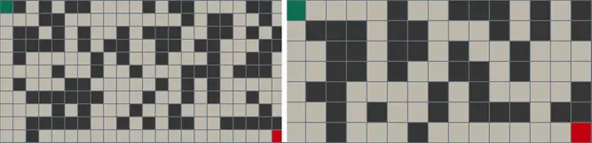

# MazeMaster

A collection of pathfinding algorithms (Dijkstra, A\*, Depth-First search, Breadth-First search) represented by audio and animations.
This project is inspired by Clément Mihailescu: https://www.youtube.com/watch?v=n4t_-NjY_Sg

### Table of Contents

- [Introduction](#introduction)
- [How it works](#how-it-works)
  - [File structure](#file-structure)
  - [Maze generators](#maze-generators)
  - [Maze solvers](#maze-solvers)
  - [User vs Algorithm](#maze-solvers)
- [How to use it](#how-to-use-it)
- [References](#references)

### Introduction

A web application that generates and solves different kind of mazes with variable height and width. There are a lot of supporting features. While solving the mazes you can toggle the speed (fast or slow), mute/listen to the sounds of the animation and compete with the algorithms by building your own path.

### How it works

Maze generation:

- Random Maze[[1]](#references)

The pathfinding algorithms:

- A\* [[2]](#references)
- Dijkstra's [[3]](#references)
- Breadth-First Search [[4]](#references)
- Depth-First Search [[4]](#references)


_Figure 1. Sample mazes._

The references have clear explanation about how the algorithms work, I won't go into details.

#### File structure

The folder structure can be seen below.

```bash
.
├── public
├── src
│   ├── algorithms
│   │		├──	maze_generation
│   │   │ 	    ├──random_maze.js
│   │   ├──	pathfinding
│   │   │	├──	a-star.js
│   │   │	├──	bfs.js
│   │   │	├──	dfs.js
│   │   │	├──	dijkstra.js
│   ├── components
│   │   ├── GridNode.jsx
│   │   ├── GridSizeSwitch.jsx
│   │   ├── NavBar.jsx
│   │   ├── Node.jsx
│   │   ├── SideBar.jsx
│   ├── animations.js
│   ├── App.css
│   ├── App.jsx
│   └── main.jsx
├── index.html
├── README.md

```

#### Maze generators

A maze is represented by a **2-dimensional array**. The number of rows or columns is variable as it depends on the length and width of the screen. The user can also toggle the size of the grid (small or large nodes).
Each cell is represented by an object as follows:

##### MSON

```
- row
- col
- isStartNode
- isEndNode
- isWall
- isUserNode
- isVisited
- previousNode
- distance
```

Generating the maze is optional (the user can visualize/listen to the pathfinding algorithms without building any walls), but if the user wants to do so, the file **random_maze.js** contains an algorithm that can build it. It fills the rows with randomly placed walls.
The user can also remove or add walls in any cell inside the grid.

#### Maze solvers

We chose 4 pathfinding algorithms: Dijkstra, A\*, Depth-First Search and Breadth-First Search.

Each algorithm has its own file and is called inside **App.jsx** due to the onClick event being fired from **NavBar.jsx**

#### User vs Algorithm

Before seeing the animation, the user can try to guess the shortest path through the maze by himself. Then compare his score with the value he gets after running one of the four algorithms.
To build his path, the user should the key 'U' and add click on the path's nodes from start to finish.

### How to use it

If you are only interested in seeing the algorithms: https://nidhal-abidi.github.io/MazeMaster/.
If you want to add or remove some features clone/fork the repo then do the following:

```
npm i
npm run dev
```

### References

[1] [Jamis Buck (The Buckblog) - Maze Generation: Algorithm Recap](https://weblog.jamisbuck.org/2011/2/7/maze-generation-algorithm-recap)<br>
[2] [Dev Community - Pathfinding with Javascript: The A\* Algorithm](https://dev.to/codesphere/pathfinding-with-javascript-the-a-algorithm-3jlb)<br>
[3] [Wikipedia - Dijkstra's algorithm](https://en.wikipedia.org/wiki/Dijkstra's_algorithm)<br>
[4] [Hackernoon - A Beginner's Guide to BFS and DFS in JavaScript](https://hackernoon.com/a-beginners-guide-to-bfs-and-dfs-in-javascript)<br>
